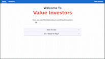
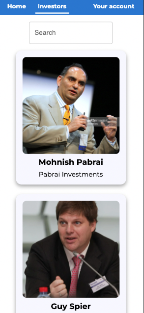
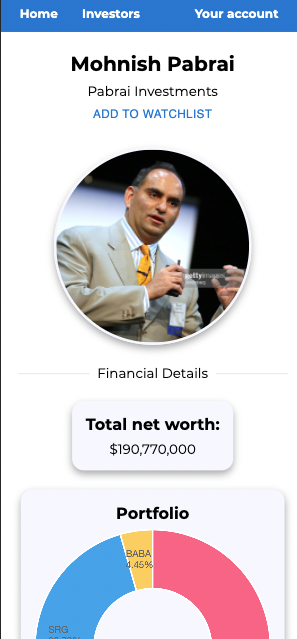

# Value Investors

REACT based site to show world **Best Investors** - their portfolio and recent activities, also you can view basic updated inormation about their stocks.

## Features

- Portfolio data
- Recent activites
- Stocks data
- Authentication with firebase auth
- Watchlist

## Demo

You can check the live demo at - [Value Investors](https://value-investors.netlify.app).

## Technologies used

- **Context API**
- **Firebase** to use firestore and auth.
- **react-router-dom** for routing.
- **Styled components** for styling.
- **MUI** for prefixed components.
- **AXIOS** for http requests.
- **Chart.js** for data presention.

## Project Summary

This project was a real breaking point in my development journey, I have learnd to work with new technologies such as firebase (firestore and auth),
Styled components and MUI to make builidng basic and complex components easier.
I have also learned and used context api for better state manangemt and avoid props and state drilling.
I am sure this project will help me to improve and continue to write better code.
